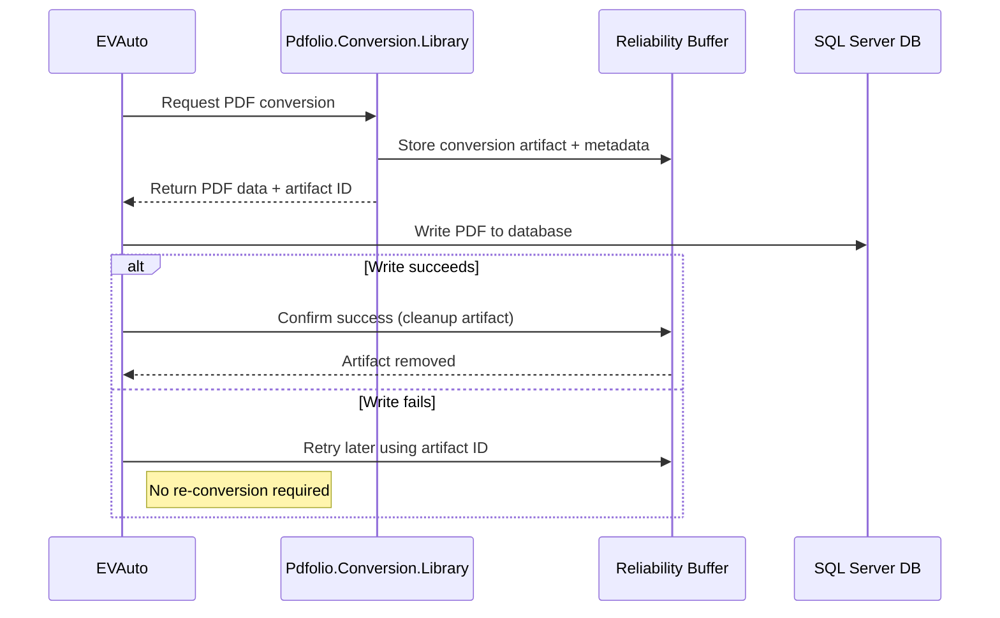

# ADR-005: PDF Conversion Handoff with Reliability Buffer

## Status

Proposed / Accepted (pending implementation)

## Date

2026-01-07

## Context

Historically, **EVAuto** performed PDF conversion internally as part of its processing loop.
As part of ongoing modernization, PDF conversion is being moved into a dedicated class library (**Pdfolio.Conversion.Library**) to improve modularity, testability, and long-term maintainability.

This introduces a new question:

> Once conversion is performed externally, what is the safest and least failure-prone way for EVAuto to receive the resulting PDF data?

Key goals:

* Minimize conversion-related failures
* Support retry and recovery without re-converting files
* Avoid tight coupling to the filesystem
* Prevent accumulation of unnecessary intermediate data
* Keep the design understandable for junior developers
* Allow future evolution (service boundaries, containers, async processing)

## Decision

We will adopt a **two-phase handoff model** using an **initial pass + backup** approach.

At a high level:

1. The conversion library performs PDF generation and produces a conversion artifact.
2. EVAuto performs the final write to the long-term SQL Server database.
3. Confirmation from EVAuto allows intermediate data to be cleaned up.
4. If the final write fails, EVAuto can retry using the backup artifact without re-running conversion.

This approach prioritizes **reliability first**, with cleanup as an explicit and observable step.

## High-Level Flow

* The **conversion library** is responsible for:

  * Producing the PDF
  * Tracking conversion metadata
  * Making the result available for pickup

* **EVAuto** is responsible for:

  * Writing the PDF to SQL Server
  * Confirming success
  * Signaling when intermediate artifacts may be discarded

No component assumes that the first write will always succeed.

## Conceptual Model (Junior-Friendly)

Think of it like this:

* **Initial pass**:
  “Here is the PDF I just made. Try to store it where it belongs.”

* **Backup**:
  “If that doesn’t work, I still have a copy so you don’t have to start over.”

* **Cleanup**:
  “Once you tell me it worked, I’ll clean up after myself.”

This avoids both silent data loss and indefinite storage.

## Why This Works Well

### Fewer Failures

* Temporary SQL Server issues do not cause permanent conversion failures
* Conversion does not need to be re-run on transient errors

### Clear Ownership

* Conversion logic lives in the library
* Final persistence logic lives in EVAuto

### Safe Cleanup

* Intermediate data is removed only after confirmation
* Cleanup is intentional, not time-based guesswork

### Future-Proof

* Works the same whether the library runs in-process, out-of-process, or as a service
* Does not depend on shared filesystem paths

## Where This Shows Up in Code

### Conversion Library

Project:

```
Pdfolio.Conversion.Library
```

Key files / concepts:

* `IPdfConverter`
* `DiskSavePdfConverter` (optional decorator)
* `ConversionRequest`
* `ConversionResult`
* Searchable terms:

  * `ConvertToPdfAsync`
  * `ConversionReport`
  * `ConversionStep`

The library produces a conversion result and tracks its status.

### Demo / Reference Implementation

Project:

```
Pdfolio.Conversion.Library.Demo
```

Relevant files:

* `Program.cs`
* `FileArchiveRepository`
* Search for:

  * `InsertFileAsync`
  * `MarkPdfSuccessAsync`
  * `MarkPdfFailedAsync`

This project demonstrates:

* Conversion
* Intermediate tracking
* Explicit success/failure handling
* Cleanup coordination

### EVAuto (Conceptual Changes)

EVAuto will:

* Receive PDF data (and a corresponding identifier)
* Attempt to write the PDF to SQL Server
* On success:

  * Signal that the conversion artifact can be removed
* On failure:

  * Retry later using the existing artifact
  * Avoid re-running conversion unless explicitly needed

No filesystem polling is required.

## Mermaid Workflow Diagram



## Alternatives Considered

### Filesystem as Primary Handoff

Rejected because:

* Path and permission issues are common failure points
* Hard to coordinate cleanup safely
* Becomes fragile across machines and environments

### Immediate Conversion + No Backup

Rejected because:

* Any transient failure forces full reprocessing
* Increases load and failure cascades

## Outcome

This approach balances reliability, clarity, and maintainability.
It allows EVAuto and the conversion library to evolve independently while reducing operational risk.

The design intentionally favors **explicit confirmation and cleanup** over implicit assumptions.

---

## Notes for Reviewers

* This ADR avoids implicit guarantees
* All cleanup is intentional and observable
* The model supports both current needs and future architecture changes
* Junior developers can follow the lifecycle end-to-end without hidden magic
