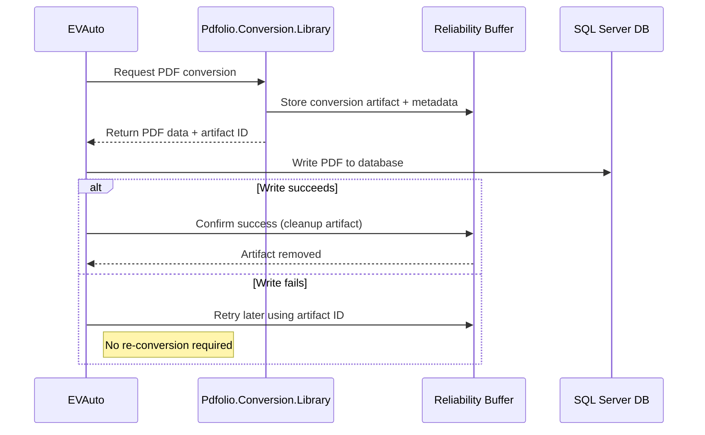

# ADR-005: PDF Conversion Handoff with Reliability Buffer

## Status

Accepted (implementation in progress)

## Date

2026-01-07

---

## Executive Summary

This decision improves the reliability of PDF generation by separating **conversion** from **final persistence**. PDF creation is handled by a dedicated conversion library, while EVAuto retains responsibility for writing PDFs to SQL Server. Conversion results are retained temporarily until EVAuto explicitly confirms success, enabling retries without re-running conversion. Cleanup is intentional and observable. This approach reduces failures, avoids unnecessary reprocessing, and allows both components to evolve independently without introducing new operational complexity.

---

## Context

Historically, **EVAuto** performed PDF conversion internally as part of its processing loop.
As part of modernization efforts, PDF conversion is being moved into a dedicated class library (**Pdfolio.Conversion.Library**) to improve modularity, testability, and long-term maintainability.

This introduces an architectural question:

> Once conversion is performed externally, what is the safest and least failure-prone way for EVAuto to receive the resulting PDF data?

Key goals:

* Minimize conversion-related failures
* Support retries without re-running conversion
* Avoid filesystem fragility
* Prevent accumulation of unnecessary intermediate data
* Keep the model understandable for junior developers
* Allow future evolution (services, containers, async processing)

---

## Decision

We will adopt a **two-phase handoff model** using an **initial pass + backup** approach.

At a high level:

1. The conversion library performs PDF generation and produces a conversion artifact.
2. EVAuto performs the final write to SQL Server.
3. EVAuto explicitly confirms success.
4. Intermediate artifacts are cleaned up only after confirmation.
5. If the final write fails, EVAuto retries using the existing artifact without re-running conversion.

This design prioritizes **reliability first**, with cleanup as an explicit and observable action.

---

## Conceptual Model (Junior-Friendly)

Think of it like this:

* **Initial pass**
  “Here is the PDF I just made. Try to store it where it belongs.”

* **Backup**
  “If that doesn’t work, I still have a copy so you don’t have to start over.”

* **Cleanup**
  “Once you tell me it worked, I’ll clean up after myself.”

No silent failures. No guessing. No indefinite storage.

---

## High-Level Responsibilities

### Conversion Library (Pdfolio.Conversion.Library)

Responsible for:

* Producing the PDF
* Tracking conversion metadata
* Making results available for pickup
* Reporting success/failure details

### EVAuto

Responsible for:

* Writing the PDF to SQL Server
* Confirming successful persistence
* Signaling when intermediate artifacts may be discarded
* Retrying persistence without re-running conversion

No component assumes the first write will succeed.

---

## Where This Appears in Code

### Pdfolio.Conversion.Library

**Purpose:** Conversion and reliability tracking

Key files:

* `Abstractions/IPdfConverter.cs`
  Entry point for conversion
* `Models/ConversionRequest.cs`
  Input bytes, metadata, correlation IDs
* `Models/ConversionResult.cs`
  PDF bytes + conversion report
* `Converters/DiskSavePdfConverter.cs` *(optional)*
  Demonstrates side effects without coupling
* `Factory/PdfConverterFactory.cs`
  Composes converters and decorators

Search terms:

* `ConvertToPdfAsync`
* `ConversionReport`
* `ConversionStep`

---

### Pdfolio.Conversion.Library.Demo

**Purpose:** Reference implementation of the full lifecycle

Key files:

* `Program.cs`
* `Data/FileArchiveRepository.cs`

Relevant methods:

* `InsertFileAsync`
* `MarkPdfSuccessAsync`
* `MarkPdfFailedAsync`

Demonstrates:

* Initial conversion
* Backup availability
* Explicit confirmation
* Intentional cleanup

---

### EVAuto (Conceptual Changes Required)

EVAuto will:

* Call into the conversion library
* Receive PDF bytes and an identifier
* Attempt SQL Server persistence
* On success:

  * Signal cleanup
* On failure:

  * Retry using existing artifacts
  * Avoid re-running conversion

No filesystem polling is required.

---

## Workflow Diagram

---

## Reviewer Q&A

### Why not write directly to SQL Server?

Because SQL Server writes are a common failure point. Separating conversion from persistence allows retries without repeating conversion work.

### Why not rely on the filesystem?

Filesystem handoffs introduce permission, path, and cleanup complexity—especially across machines. Coordinating retries safely becomes fragile.

### Why keep intermediate data at all?

The backup artifact prevents unnecessary reprocessing and improves recovery from transient failures.

### Why not time-based cleanup?

Time-based cleanup relies on assumptions. This design uses **explicit confirmation**, which is observable and reliable.

### Why not re-run conversion on failure?

Re-running conversion increases load and compounds failures. Retrying with existing artifacts is safer and faster.

### Does this block future service extraction?

No. The model is execution-context agnostic and works in-process, out-of-process, or as a service.

---

## Alternatives Considered

### Filesystem as Primary Handoff

Rejected due to fragility, cleanup complexity, and environment sensitivity.

### Immediate Conversion with No Backup

Rejected due to increased failure cascades and unnecessary reprocessing.

---

## Outcome

This design reduces operational risk while keeping responsibilities clear and code understandable. Cleanup is intentional, retries are predictable, and components can evolve independently.

---

## Notes for Reviewers

* Cleanup is explicit and observable
* No implicit guarantees are assumed
* The design favors reliability over convenience
* Junior developers can follow the lifecycle end-to-end
* Future architectural changes are enabled, not forced
