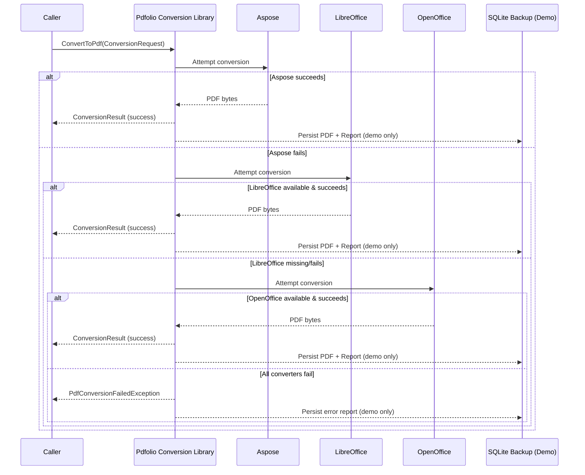

# Pdfolio.Conversion.Library

**Pdfolio** is a **library-first PDF conversion system** for .NET 8 that converts Office documents into PDFs using a deterministic, auditable conversion pipeline.

The project is intentionally **host-agnostic** and designed to be embedded into other applications (console apps, services, APIs, schedulers) without modification.

---

## What Pdfolio Does

* Converts Office documents → PDF
* Uses **Aspose** as the primary converter
* Falls back to **LibreOffice** and **OpenOffice** (headless)
* Produces a **structured JSON conversion report**
* Optionally persists results to SQLite (demo only)

---

## What Pdfolio Does *Not* Do

* ❌ Assume IIS, HTTP, or UI
* ❌ Write output files to disk in the library
* ❌ Depend on SQLite or any database
* ❌ Log to the console from library code

---

## High-Level Architecture

```
Caller Application
        |
        v
Pdfolio.Conversion.Library
        |
        v
PDF bytes + ConversionReport
```

The library returns **data**, not side effects.

---

## Conversion Sequence (End-to-End)



### Key Guarantees

* Converter order is **fixed and deterministic**
* Missing binaries are **not fatal**
* Every attempt is recorded in the report
* The caller always knows **what happened and why**

---

## Repository Structure

```
Pdfolio.Conversion.Library/
├── Pdfolio.Conversion.Library/        # Core conversion library
│   ├── Abstractions/
│   ├── Converters/
│   ├── Factory/
│   ├── Locators/
│   ├── Models/
│   ├── Exceptions/
│   ├── Data/                          # SQLite (demo only)
│   └── Utility/
│
├── Pdfolio.Conversion.Library.Demo/   # Console demo / harness
│   ├── Program.cs
│   ├── appsettings.json
│   └── Data/                          # Local DB (gitignored)
│
├── Pdfolio.TestFiles/                 # Input test documents
│
├── .github/
│   └── copilot-instructions.md
│
├── README.md
└── .gitignore
```

---

## Core Concepts

### ConversionRequest

Represents a single conversion job:

* Input bytes
* Filename + extension
* Correlation ID
* Arbitrary metadata tags

### ConversionResult

Returned on success:

* PDF bytes
* ConversionReport

### ConversionReport

Structured JSON describing:

* Which converters were attempted
* Duration per attempt
* Success/failure reasons
* Final converter used

This report is designed for **auditability**, not logging.

---

## Demo Application

`Pdfolio.Conversion.Library.Demo` is a **test harness**, not a production component.

It demonstrates:

* CLI argument handling
* Folder and single-file conversion
* SQLite persistence
* Human-readable console output

### Run the demo

```powershell
cd Pdfolio.Conversion.Library.Demo
dotnet run -- --folder "..\Pdfolio.TestFiles"
```

Or a single file:

```powershell
dotnet run -- "..\Pdfolio.TestFiles\sample.docx"
```

---

## SQLite Backup Database (Demo Only)

The demo persists results to:

```
bin/Debug/net8.0/Data/PdfolioBackup.db
```

Stored fields include:

* Original file metadata
* PDF BLOB
* Conversion report JSON
* Error JSON (if failed)

> SQLite exists **only** to make demo results inspectable.
> The library itself does not depend on it.

---

## Configuration (Demo)

```json
{
  "Pdf": {
    "Mode": "Auto",
    "TimeoutSeconds": 60,
    "TempPath": "Temp\\Pdfolio",
    "AsposeLicensePath": "..\\Pdfolio.Conversion.Library\\licenses\\aspose.lic"
  }
}
```

---

## Error Handling Philosophy

* Errors are **data**, not strings
* Exceptions preserve original context
* Missing converters ≠ failure
* Failures are explainable, not silent

---

## Intended Evolution

Pdfolio is designed to be reused by:

* IIS-hosted APIs
* Windows services
* Queue workers
* Scheduled jobs
* Containerized services

No architectural changes are required to support these.

---

## Philosophy

> Convert once.
> Know exactly how it happened.
> Never guess why it failed.